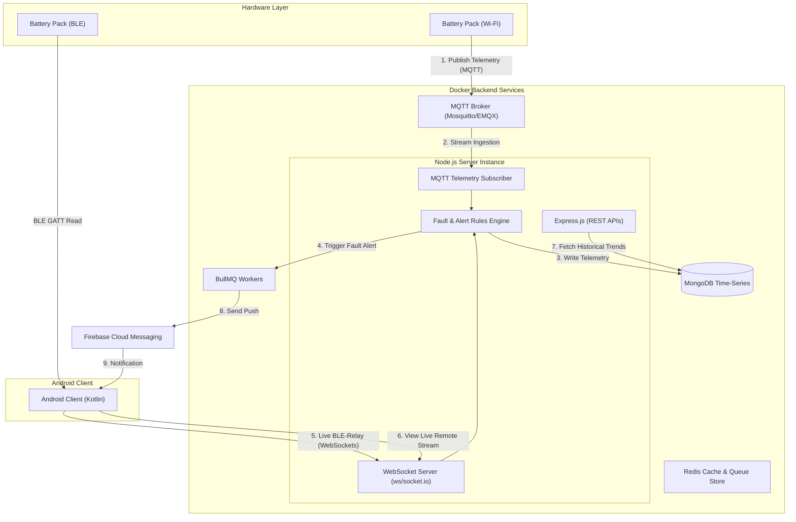

# Backend Architecture Specification (Node.js + Express + MQTT + WebSockets)
## Project: Battery Management System (BMS) Backend

---

## 1. System Architecture Overview

The BMS backend is a high-throughput, event-driven Node.js system designed to ingest, process, and store high-frequency telemetry while serving real-time status updates to client applications.



---

## 2. Module Specifications

### 2.1 Authentication Module
*   **Mechanism**: JSON Web Tokens (JWT) for stateless sessions.
*   **Tokens**:
    *   *Access Token*: Short-lived (15 minutes), containing user ID and role, signed with a private key. Handled in the header (`Authorization: Bearer <Token>`).
    *   *Refresh Token*: Long-lived (7 days), stored in an `HttpOnly`, secure cookie to prevent Cross-Site Scripting (XSS).
*   **Role-Based Access Control (RBAC)**: Custom middlewares enforce access levels:
    *   `requireAuth`: Decodes and validates the JWT.
    *   `requireRole(['tech', 'admin'])`: Restricts endpoints (like safety threshold configuration or firmware uploads).

### 2.2 Device Management Module
*   **Responsibilities**: Manages IoT hardware provisioning, status tracking, and user claims.
*   **Device Claims**: Employs a verification system mapping serial numbers to battery packs. Users input a QR-code payload, and the backend re-assigns the `ownerId` in MongoDB.
*   **Heartbeat Tracker**: A background job checking the `lastHeartbeat` property. If a device fails to check in (either via MQTT status topics or WebSocket pings) within 60 seconds, its database status transitions to `OFFLINE`.

### 2.3 Battery Monitoring (Real-time Ingestion & WebSockets)
Handles dual-channel telemetry ingestion (MQTT for Wi-Fi battery packs, and WebSockets for local BLE-relayed data):
*   **MQTT Ingestion**: A dedicated MQTT client module connects to the broker, subscribing to `bms/v1/devices/+/telemetry`. When a message arrives:
    1. Validates the JSON payload.
    2. Writes data to the MongoDB Time-Series collection.
    3. Triggers the Fault Detection Engine.
    4. Relays data to the WebSocket module.
*   **WebSocket Pipeline (using `socket.io` or standard `ws`)**:
    *   *Remote Clients*: Mobile applications join room namespaces mapped to device IDs (`device_room_{deviceId}`) to receive real-time streams published by Wi-Fi packs.
    *   *BLE Relay*: For packs without Wi-Fi, the Android app reads metrics via BLE and pushes them up the WebSocket stream to the backend. This enables persistent cloud logging and remote technician observation while local connections are active.

### 2.4 Firmware Management & OTA Updates
*   **Storage**: Binaries are uploaded by administrators and stored in an S3-compatible cloud storage (or local Docker volume).
*   **Endpoints**: Serves checksum-validated metadata and download paths.
*   **Flashing Orchestration**:
    *   *Wi-Fi OTA*: The backend publishes an update command with binary URL and SHA-256 signature to the device's MQTT command topic. The device downloads the bin, flashes it, and publishes progress metrics.
    *   *BLE OTA*: The backend provides the download URL to the Android app, which streams the blocks to the hardware BMS.

### 2.5 Notification Service
*   **Integration**: Firebase Cloud Messaging (FCM) Admin SDK.
*   **Design Pattern**: Asynchronous processing. High-priority alerts must not block telemetry ingestion.
*   **Queueing**: When a warning fires, the backend pushes a job to Redis. A BullMQ background worker picks up the job, retrieves user registration tokens, and invokes the FCM gateway.

### 2.6 Fault Detection Engine
*   **Execution**: Synchronous processing inside the telemetry pipe.
*   **Rules Engine**: Compares incoming metrics against limits defined in `deviceSettings`:
    *   Over-Voltage / Under-Voltage threshold trips.
    *   Current protection limits.
    *   High-temperature safety constraints.
*   **Pipeline Actions on Trip**:
    1. Write entry to `faultLogs`.
    2. Dispatch an immediate high-priority alert event over active WebSockets.
    3. Queue an immediate push notification to FCM.
    4. If the pack is online via MQTT, publish a shutdown command to `bms/v1/devices/{deviceId}/commands` to open protection relays.

### 2.7 Logging Module
*   **Framework**: `winston` for application logging, coupled with `morgan` for Express HTTP request logging.
*   **Format**: Structured JSON logs written to standard output (`stdout`), facilitating aggregation in Docker routing logs or ELK stacks.
*   **Log Levels**: Separated into `error` (for exceptions and faults), `warn` (for threshold crossings), and `info` (for auth/connections).

### 2.8 Error Handling
*   **Operational Errors**: Handled using a centralized class `AppError` extending `Error`. Captures `statusCode` and an `isOperational` flag.
*   **Express Error Middleware**: Intercepts unhandled errors, logs the stack trace, and sends a sanitized, structured JSON response.
*   **Process Protection**: Listens for `uncaughtException` and `unhandledRejection` events, initiates a graceful shutdown sequence (closing MongoDB connections, draining WebSocket channels, and closing MQTT connections) before exiting.

### 2.9 Background Jobs
*   **Orchestration Engine**: BullMQ backed by a Redis container.
*   **Job Routines**:
    *   *Device Timeout Sweep*: Runs every 30 seconds to flag unresponsive devices.
    *   *Telemetry Aggregation*: Daily job rolling up telemetry entries older than 30 days into aggregated session profiles before Time-Series TTL deletion.
    *   *Alert Retries*: Attempts redeliveries of failed notifications.

---

## 3. API Versioning & Security

### 3.1 API Versioning
To maintain backward compatibility with older Android app versions deployed in the field:
*   **URL Path Versioning**: Base paths prefix the API version: `/api/v1/`.
*   **Structure**: Route structures are separated by directories to allow simple routing mappings for future upgrades (e.g., `/routes/v1/` and `/routes/v2/`).

### 3.2 Security Configuration
*   **HTTP Hardening**: `helmet` middleware is injected to set response headers preventing clickjacking, MIME sniffing, and cross-site scripting.
*   **Rate Limiting**: `express-rate-limit` prevents brute-force attempts on `/api/v1/auth/` routes and DDoS attempts on logs.
*   **Data Protection**:
    *   MongoDB query filtering to prevent NoSQL injection.
    *   Helmet CORS configurations allowing connections only from authorized domains.
*   **MQTT Security**: MQTT broker requires TLS/SSL client credentials or token authentication.

---

## 4. Folder Structure (Clean Architectural Layout)

```
bms-backend/
├── .github/workflows/          # CI/CD configurations
├── certs/                      # SSL/TLS certs for local development
├── config/                     # Configuration wrappers
│   ├── db.js                   # Mongoose connection
│   ├── mqtt.js                 # MQTT Broker client configuration
│   ├── redis.js                # Redis & BullMQ connections
│   └── settings.js             # Environment variables mapping
├── src/
│   ├── app.js                  # Express application setup
│   ├── server.js               # Entry point (Server, WebSocket server, MQTT init)
│   │
│   ├── controllers/            # Controller layers (Extract data, delegate, return HTTP)
│   │   ├── auth.controller.js
│   │   ├── device.controller.js
│   │   └── telemetry.controller.js
│   │
│   ├── middlewares/            # Custom express middlewares
│   │   ├── auth.middleware.js
│   │   ├── error.middleware.js
│   │   └── rateLimiter.js
│   │
│   ├── models/                 # Mongoose models and schema declarations
│   │   ├── User.js
│   │   ├── BatteryPack.js
│   │   └── Telemetry.js        # Time-Series collection schema
│   │
│   ├── routes/                 # API Versioned Routers
│   │   └── v1/
│   │       ├── auth.routes.js
│   │       ├── device.routes.js
│   │       └── index.js
│   │
│   ├── services/               # Core business logic / Platform adapters
│   │   ├── auth.service.js
│   │   ├── fcm.service.js
│   │   ├── mqtt.service.js     # MQTT subscription and ingestion loop
│   │   ├── websocket.service.js# Handles socket channels and namespaces
│   │   └── rulesEngine.js      # Fault checking service
│   │
│   ├── utils/                  # Helper utilities (error classes, checkers)
│   │   └── appError.js
│   │
│   └── workers/                # BullMQ Background workers
│       ├── notification.worker.js
│       └── rollup.worker.js
│
├── Dockerfile                  # Production container definition
├── docker-compose.yml          # Local multi-container development environment
└── package.json
```

---

## 5. Docker Infrastructure Specification

### 5.1 Dockerfile
The backend runs in a node-alpine container for a minimal security attack surface. It utilizes multi-stage builds to keep production containers light.

```dockerfile
# Stage 1: Build dependencies
FROM node:20-alpine AS builder
WORKDIR /usr/src/app
COPY package*.json ./
RUN npm ci --only=production

# Stage 2: Final image
FROM node:20-alpine
WORKDIR /usr/src/app
ENV NODE_ENV=production
COPY --from=builder /usr/src/app/node_modules ./node_modules
COPY package*.json ./
COPY src/ ./src
COPY config/ ./config

EXPOSE 3000 8080
USER node
CMD ["node", "src/server.js"]
```

### 5.2 docker-compose.yml
For local orchestration, the composition starts the Node backend, MongoDB (with Time-Series support enabled), Redis, and an Eclipse Mosquitto MQTT broker.

```yaml
version: '3.8'

services:
  app:
    build: .
    ports:
      - "3000:3000"   # HTTP/REST API
      - "8080:8080"   # WebSocket server
    environment:
      - NODE_ENV=development
      - PORT=3000
      - MONGO_URI=mongodb://db:27017/bms_dev
      - REDIS_URI=redis://cache:6379
      - MQTT_BROKER_URL=mqtt://broker:1883
    depends_on:
      - db
      - cache
      - broker
    volumes:
      - ./src:/usr/src/app/src

  db:
    image: mongodb/mongodb-community-server:7.0-ubuntu2204
    ports:
      - "27017:27017"
    volumes:
      - mongo-data:/data/db

  cache:
    image: redis:7-alpine
    ports:
      - "6379:6379"

  broker:
    image: eclipse-mosquitto:2
    ports:
      - "1883:1883"   # MQTT non-TLS port
      - "9001:9001"   # MQTT over WebSockets
    volumes:
      - ./config/mosquitto.conf:/mosquitto/config/mosquitto.conf
      - mosquitto-data:/mosquitto/data

volumes:
  mongo-data:
  mosquitto-data:
```
