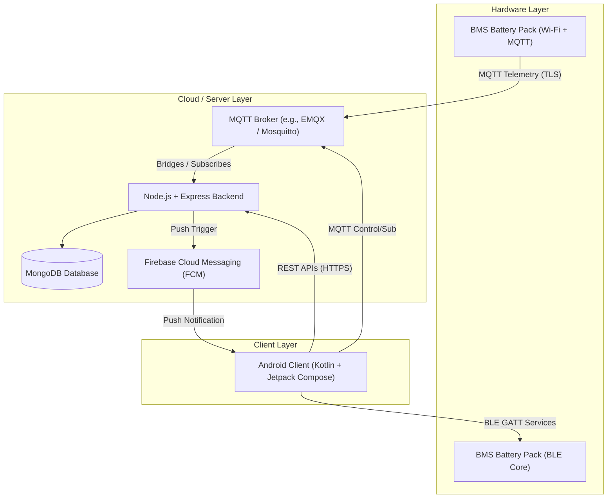

# Software Requirement Specification (SRS)
## Project: Battery Management System (BMS) Monitoring and Control Application

---

## 1. Introduction & System Overview

### 1.1 Purpose
This document specifies the software requirements for the Battery Management System (BMS) Monitoring and Control application. The system enables real-time monitoring, configuration, remote control, and firmware tracking for multi-cell lithium-based battery packs.

### 1.2 System Scope
The system consists of a single-platform native Android client communicating with battery packs using two protocols:
1. **Bluetooth Low Energy (BLE)**: Used for local, high-frequency, low-latency monitoring and control when in physical proximity to the battery pack.
2. **MQTT (Message Queuing Telemetry Transport)**: Used for remote monitoring and control when the battery packs are connected to the internet via Wi-Fi.

A Node.js backend manages user accounts, aggregates historical logs, handles device provisioning, tracks firmware OTA updates, and routes push notifications. MongoDB acts as the centralized data store.



### 1.3 Technology Stack
*   **Mobile Platform**: Android (Kotlin, Jetpack Compose, MVVM Architecture, Hilt for Dependency Injection, Coroutines & Flows, Room for local caching, Ktor or Retrofit for REST API requests).
*   **Backend Services**: Node.js, Express.js.
*   **Database**: MongoDB with Mongoose ODM.
*   **Communication Layer**:
    *   *Local*: Bluetooth Low Energy (BLE GATT Profiles).
    *   *Remote*: MQTT (with TLS encryption).
*   **Notification Engine**: Firebase Cloud Messaging (FCM).

---

## 2. User Roles & Access Control

The system supports two distinct roles with corresponding access permissions:

### 2.1 End User (Owner / Operator)
*   **Description**: The primary operator of the battery packs.
*   **Permissions**:
    *   Register, log in, and manage their profile.
    *   Claim and pair battery packs (via BLE scan or scanning a QR code/serial number).
    *   View real-time telemetry (SoC, voltage, current, temperatures, cell balance status) for their owned devices.
    *   Receive real-time push notifications and alerts on critical faults.
    *   Toggle charging/discharging switches (if authorized for that device).
    *   View historical charging/discharging logs and SoH trends.

### 2.2 Technician / Administrator
*   **Description**: Advanced users responsible for battery commissioning, system calibration, and firmware maintenance.
*   **Permissions**:
    *   All permissions of the End User.
    *   Modify critical safety thresholds (e.g., Over-Voltage Protection, Under-Voltage Protection, Over-Current Protection, Temperature limits).
    *   Publish and manage new Firmware OTA binaries in the backend.
    *   Initiate firmware update notifications to specific battery batches.
    *   Inspect system-wide diagnostic logs.

---

## 3. Functional Requirements

### 3.1 Real-Time Battery Monitoring
*   **FR-MON-1 (Pack Level Telemetry)**: The system must display overall battery pack metrics:
    *   State of Charge (SoC) as a percentage (0% to 100%).
    *   State of Health (SoH) as a percentage.
    *   Pack Voltage (V).
    *   Pack Current (A) - positive for charging, negative for discharging.
    *   Average and hot-spot Temperatures (°C).
*   **FR-MON-2 (Cell Level Telemetry)**: The system must display cell-by-cell voltages for series-connected groups (e.g., 4S to 16S configs).
*   **FR-MON-3 (Cell Balancing Visualization)**: The system must display active cell balancing indicators, highlighting cells currently undergoing passive or active balancing.
*   **FR-MON-4 (High Frequency BLE Data)**: When connected locally via BLE, telemetry must update at a configurable interval of 1Hz to 5Hz.
*   **FR-MON-5 (MQTT Data Stream)**: When monitoring remotely via MQTT, telemetry updates must occur at 0.1Hz to 0.5Hz to conserve cellular/Wi-Fi bandwidth, unless a fault state is active.

### 3.2 Battery Control & Configuration
*   **FR-CON-1 (Charging Control)**: Authorized users must be able to send commands to toggle the Charge MOSFET (on/off).
*   **FR-CON-2 (Discharging Control)**: Authorized users must be able to send commands to toggle the Discharge MOSFET (on/off).
*   **FR-CON-3 (Current Limits)**: Technicians must be able to write configuration values to adjust maximum charging and discharging current limits.
*   **FR-CON-4 (Threshold Configuration)**: Technicians must be able to configure:
    *   Cell Over-Voltage (COV) and Under-Voltage (CUV) protection thresholds.
    *   Pack Over-Voltage (POV) and Under-Voltage (PUV) protection thresholds.
    *   Over-Temperature Protection (OTP) limits for charging and discharging.
*   **FR-CON-5 (Command Acknowledgement)**: The app must display confirmation and validation status when a write command is sent (via BLE write callback or MQTT command acknowledgement topic).

### 3.3 Fault Detection & Alerts
*   **FR-FLT-1 (Immediate Detection)**: The system must detect critical faults locally (via BLE notification flags) and remotely (via MQTT status payloads):
    *   Short Circuit Protection (SCP)
    *   Over-Current Charge (OCC) / Over-Current Discharge (OCD)
    *   Cell Under-Voltage / Over-Voltage
    *   Over-Temperature / Under-Temperature
    *   Sensor Failure (e.g., disconnected thermistor)
*   **FR-FLT-2 (Local Alarm)**: The Android app must play an auditory alert and trigger a high-priority UI modal when a critical fault is detected while actively connected.
*   **FR-FLT-3 (Remote Alerts)**: The backend must process incoming fault payloads from the MQTT broker and dispatch high-priority push notifications immediately.

### 3.4 Charging History & Diagnostics Logs
*   **FR-HIS-1 (Session Aggregation)**: The backend must compile charging sessions, capturing energy added (Wh), starting/ending SoC, session duration, and peak temperatures.
*   **FR-HIS-2 (Historical Charts)**: The Android app must render historical charts (daily/weekly/monthly) for SoC cycles and SoH degradation.
*   **FR-HIS-3 (Local Offline Logging)**: The Android app must store BLE telemetry locally in a Room database when internet connectivity is unavailable, and synchronize with the cloud once a connection is re-established.

### 3.5 User Authentication & Device Association
*   **FR-ATH-1 (User Auth)**: Secure registration, login, and password management via JWT tokens.
*   **FR-ATH-2 (Device Claiming)**: Users must pair a battery pack with their account using a unique hardware serial key or QR code.
*   **FR-ATH-3 (Ownership Enforcement)**: Only the verified owner (or an administrator) can control or monitor the telemetry of a specific battery pack.

### 3.6 Firmware Tracking & OTA Updates
*   **FR-OTA-1 (Version Checking)**: The Android app and Backend must query the active firmware version of the battery pack and cross-reference it with the latest firmware available for that model.
*   **FR-OTA-2 (Metadata Management)**: The backend must host firmware metadata, download URLs, release notes, and hardware compatibility mappings.
*   **FR-OTA-3 (Update Initiation)**: Administrators can flag a release as critical, forcing or recommending update indicators in the Android UI. 
*   **FR-OTA-4 (File Transfer Tracking)**:
    *   *BLE OTA*: The Android app downloads the binary from the backend and performs a local block-by-block GATT transfer to the battery pack.
    *   *WiFi OTA*: The backend sends an MQTT command to the battery pack, which then downloads the binary directly via HTTPS.

### 3.7 Push Notifications
*   **FR-NOT-1 (Critical Warnings)**: Push notifications must be dispatched immediately when thermal runaway parameters or critical cell failures occur.
*   **FR-NOT-2 (OTA Alerts)**: Notifications must alert users when new firmware fixes or safety updates are available.
*   **FR-NOT-3 (Notification Rules)**: Users must be able to toggle notification categories (e.g., Info logs, warnings, updates) except for safety-critical alerts.

---

## 4. Non-Functional Requirements

### 4.1 Security & Data Integrity
*   **NFR-SEC-1 (Local Communication)**: BLE communication must implement custom authentication steps post-connection (e.g., cryptographic challenge-response) to prevent unauthorized devices from sending GATT write commands.
*   **NFR-SEC-2 (Cloud Transit)**: All HTTPS REST requests and MQTT connections must use TLS (v1.3 preferred, v1.2 minimum) with token-based authorization (JWT).
*   **NFR-SEC-3 (Data Encryption)**: Sensitive information, including user passwords and connection tokens, must be hashed using bcrypt in the database.
*   **NFR-SEC-4 (Encrypted Storage)**: Android local credentials and tokens must be stored in the EncryptedSharedPreferences library.

### 4.2 Performance & Responsiveness
*   **NFR-PER-1 (BLE Connection Latency)**: BLE service discovery and connection status transitions in the UI must complete within 2.5 seconds under normal conditions.
*   **NFR-PER-2 (MQTT Latency)**: Control commands issued over MQTT must be received by the device within 1 second under average network conditions.
*   **NFR-PER-3 (Battery Optimization)**: Android BLE scanning must use opportunistic scanning modes and stop scans automatically after a timeout (e.g., 10 seconds) to prevent excessive device battery drain.

### 4.3 Reliability & Safety (Crucial Fail-Safes)
*   **NFR-REL-1 (Hardware Autonomy)**: The BMS hardware must execute safety trips independently of the app or backend. The app is a monitoring and secondary command utility; primary safety (e.g., cutting off charge during over-voltage) must remain hardcoded inside the hardware BMS.
*   **NFR-REL-2 (Connection Resilience)**: The Android app must implement automatic reconnection logic (exponential backoff) for both BLE GATT connections and MQTT client connections.
*   **NFR-REL-3 (Offline State Handlers)**: The mobile app must gracefully transition to "Offline Mode" when backend networks fail, retaining full capability to read telemetry and toggle switches locally over BLE.

---

## 5. System Architecture & Protocols

### 5.1 Communication Protocols

#### 5.1.1 Bluetooth Low Energy (GATT Configuration)
The BLE profile for the BMS must consist of a Primary Service with specific read, write, and notify characteristics:
*   **BMS Primary Service UUID**: `4b4d-53-42-4d-53-5f-53-45-52-56-49-43-45`
*   **Telemetry Characteristic (Read/Notify)**: `4b4d-53-42-4d-53-5f-54-45-4c-45-4d-45-54-52-59`
    *   Transmits structured binary frames (containing voltage, current, SoC, temperatures, and faults).
*   **Control Characteristic (Write/Write Without Response)**: `4b4d-53-42-4d-53-5f-43-4f-4e-54-52-4f-4c`
    *   Receives command bytes (e.g., Charge switch toggle, Discharge switch toggle, threshold configurations).

#### 5.1.2 MQTT Topic Architecture
MQTT clients must leverage a clean, structured topic hierarchy to avoid cross-device message clutter.
*   **Base Prefix**: `bms/v1/`
*   **Hierarchy structure**:
    *   Telemetry Publish: `bms/v1/devices/{deviceId}/telemetry`
    *   Fault/Status Publish: `bms/v1/devices/{deviceId}/status`
    *   Command Subscribe: `bms/v1/devices/{deviceId}/commands`
    *   Command Response Publish: `bms/v1/devices/{deviceId}/commands/response`
    *   OTA Notification Subscribe: `bms/v1/devices/{deviceId}/ota`

---

## 6. Database Overview (MongoDB Schema Design)

Below is the design of the MongoDB database schemas mapped through Mongoose.

```
┌─────────────────────────────────┐
│              User               │
├─────────────────────────────────┤
│ _id: ObjectId                   │
│ email: String (Unique)          │
│ passwordHash: String            │
│ role: String ['user', 'admin']  │
│ deviceIds: Array[ObjectId]      │
│ createdAt: Date                 │
└────────────────┬────────────────┘
                 │ (1 to Many)
                 ▼
┌─────────────────────────────────┐
│           BatteryPack           │
├─────────────────────────────────┤
│ _id: ObjectId                   │
│ serialNumber: String (Unique)   │
│ modelNumber: String             │
│ nominalCapacityAh: Number       │
│ cellConfiguration: String       │
│ hardwareVersion: String         │
│ firmwareVersion: String         │
│ ownerId: ObjectId               │
│ lastConnectedAt: Date           │
│ settings: Object                │
│   ├─ overVoltageLimit: Number   │
│   ├─ underVoltageLimit: Number  │
│   └─ maxChargeCurrent: Number   │
└────────────────┬────────────────┘
                 ├──────────────────────────────┐
                 │ (1 to Many)                  │ (1 to Many)
                 ▼                              ▼
┌─────────────────────────────────┐    ┌─────────────────────────────────┐
│          TelemetryLog           │    │           FaultAlert            │
├─────────────────────────────────┤    ├─────────────────────────────────┤
│ _id: ObjectId                   │    │ _id: ObjectId                   │
│ deviceId: ObjectId              │    │ deviceId: ObjectId              │
│ timestamp: Date                 │    │ timestamp: Date                 │
│ soc: Number                     │    │ faultType: String               │
│ soh: Number                     │    │ severity: String                │
│ packVoltage: Number             │    │ cellVoltages: Array[Number]     │
│ packCurrent: Number             │    │ details: String                 │
│ temperatures: Array[Number]     │    │ resolved: Boolean               │
│ cellVoltages: Array[Number]     │    │ resolvedAt: Date                │
└─────────────────────────────────┘    └─────────────────────────────────┘
```

### 6.1 Schema Definitions (Conceptual Representation)

#### 6.1.1 User Collection
Represents verified system users and administrators.
*   `email`: String, required, unique, validated index.
*   `passwordHash`: String, required.
*   `role`: String, enum: `['user', 'tech', 'admin']`, default: `'user'`.
*   `devices`: Array of ObjectIds pointing to `BatteryPack`.

#### 6.1.2 BatteryPack Collection
Represents registered battery packs and their static configuration attributes.
*   `serialNumber`: String, required, unique index.
*   `modelNumber`: String, required.
*   `nominalCapacityAh`: Number, required.
*   `cellConfiguration`: String (e.g., `"16S2P"`), required.
*   `hardwareVersion`: String, required.
*   `firmwareVersion`: String, required.
*   `ownerId`: ObjectId, ref: `User`, nullable.
*   `safetyThresholds`: Object:
    *   `cellOverVoltageLimit`: Number (Volts)
    *   `cellUnderVoltageLimit`: Number (Volts)
    *   `maxChargeCurrent`: Number (Amperes)
    *   `maxDischargeCurrent`: Number (Amperes)
    *   `maxTemperatureLimit`: Number (°C)

#### 6.1.3 TelemetryLog Collection
Time-series collection (or structured collection with TTL index) optimized for continuous reads and writes.
*   `deviceId`: ObjectId, ref: `BatteryPack`, indexed.
*   `timestamp`: Date, indexed.
*   `soc`: Number, 0-100.
*   `soh`: Number, 0-100.
*   `packVoltage`: Number (Volts).
*   `packCurrent`: Number (Amperes).
*   `temperatures`: Array of Numbers (Probe values in °C).
*   `cellVoltages`: Array of Numbers (individual cell voltages in Volts).
*   *Note*: A TTL index of 90 days is implemented on this collection to manage database size constraints. High-resolution charging logs are rolled up into session reports before purging.

#### 6.1.4 FaultAlert Collection
Tracks historical and active faults flagged by the hardware.
*   `deviceId`: ObjectId, ref: `BatteryPack`, indexed.
*   `timestamp`: Date.
*   `faultType`: String (e.g., `CELL_OVER_VOLTAGE`, `THERMAL_OVERLIMIT`, `SHORT_CIRCUIT`).
*   `severity`: String, enum: `['INFO', 'WARNING', 'CRITICAL']`.
*   `cellVoltages`: Array of Numbers (captured status of cells at fault incident).
*   `resolved`: Boolean, default: `false`.
*   `resolvedAt`: Date.

#### 6.1.5 FirmwareRelease Collection
Tracks uploaded binaries for OTA distribution.
*   `version`: String, required.
*   `compatibleHardwareVersions`: Array of Strings.
*   `binaryUrl`: String, required.
*   `releaseDate`: Date.
*   `isCritical`: Boolean.

---

## 7. API Overview

The API communicates via HTTP/HTTPS REST for administration, configuration, and diagnostics setup, and via MQTT for real-time channels.

### 7.1 REST Web Services (Express routes)

#### 7.1.1 Authentication Module
*   `POST /api/v1/auth/register`: Register new user profile.
*   `POST /api/v1/auth/login`: Authenticate and return JWT token + expiration details.

#### 7.1.2 Device Registration & Association
*   `GET /api/v1/devices`: Fetch user's registered battery packs.
*   `POST /api/v1/devices/claim`: Associate a pack with the user account via serial key.
*   `GET /api/v1/devices/{id}/details`: Fetch specifications and current firmware details.

#### 7.1.3 Commands & Configuration
*   `PUT /api/v1/devices/{id}/thresholds`: Update hardware safety thresholds (requires `tech` or `admin` token).
*   `POST /api/v1/devices/{id}/control`: Dispatch remote switch states (e.g., `{"command": "CHARGE_OFF"}`).

#### 7.1.4 History & Diagnostic Data
*   `GET /api/v1/devices/{id}/history`: Paginated query for telemetry trends, filterable by date ranges.
*   `GET /api/v1/devices/{id}/faults`: Retrieve a list of logged system faults.

#### 7.1.5 Firmware & OTA
*   `GET /api/v1/firmware/check`: Compare a hardware model's active version with the cloud registry.
*   `POST /api/v1/firmware/upload`: Push new binaries (requires `admin` token).

---

## 8. Android Client Architecture & Folder Structure

The Android Application uses **MVVM Clean Architecture** built on Kotlin Multi-Module patterns to decouple UI layers from core hardware BLE and Network transport code.

### 8.1 Android Clean Package Architecture

```
com.project.bms
│
├── di                          # App-wide Hilt Dependency Injection modules
│   ├── NetworkModule.kt        # Retrofit, OkHttpClient, MQTT bindings
│   ├── DatabaseModule.kt       # Room Database providers
│   └── BleModule.kt            # BLE scanner and connection managers
│
├── data                        # Repository Implementation, Network & BLE services
│   ├── local                   # Room Cache, EncryptedSharedPreferences
│   │   ├── BmsDatabase.kt
│   │   └── dao/
│   │
│   ├── remote                  # REST API Clients & MQTT Client implementation
│   │   ├── BmsApiService.kt
│   │   └── MqttClientService.kt
│   │
│   ├── ble                     # Low-level BLE stack
│   │   ├── BleConnectionManager.kt  # BLE connection state machine, GATT callbacks
│   │   ├── BleDeviceScanner.kt      # Scan filters, permission checks
│   │   └── BlePacketParser.kt       # Converts raw bytes/byte-arrays to telemetry objects
│   │
│   └── repository              # Single source of truth merging Cloud, BLE, and Cache
│       ├── BatteryRepositoryImpl.kt
│       └── UserRepositoryImpl.kt
│
├── domain                      # Business logic, Models & Use Cases (Independent of UI)
│   ├── model                   # Clean Domain Entities
│   │   ├── BatteryPack.kt
│   │   ├── Telemetry.kt
│   │   └── Fault.kt
│   │
│   └── usecase                 # Reusable domain interactors
│       ├── GetRealtimeTelemetryUseCase.kt
│       ├── SendControlCommandUseCase.kt
│       └── AuthenticateUserUseCase.kt
│
└── ui                          # Jetpack Compose UI layer
    ├── theme                   # Custom Color Palette, Type, and Shapes (Dark Mode prioritized)
    │
    ├── common                  # Shared UI components (custom charts, dials, custom status cards)
    │
    ├── dashboard               # Main Dashboard screen
    │   ├── DashboardScreen.kt
    │   └── DashboardViewModel.kt
    │
    ├── detail                  # Detailed Cell View, Balancing, and Temperature grids
    │   ├── DetailScreen.kt
    │   └── DetailViewModel.kt
    │
    ├── control                 # Commands and limit-threshold editing panels
    │   ├── ControlScreen.kt
    │   └── ControlViewModel.kt
    │
    └── navigation              # NavHost, Navigation Actions, Screen Routes
```

---

## 9. Node.js Backend Architecture & Folder Structure

The Node.js project implements a clean MVC structure to handle business logic, data persistence, and communication gateways.

### 9.1 Backend Folder Structure

```
bms-backend
│
├── config/                     # Configuration parameters and database connections
│   ├── db.js                   # Mongoose configuration and connection
│   └── mqtt.js                 # MQTT Broker connection & Subscription hooks
│
├── controllers/                # Handlers for HTTP endpoints
│   ├── authController.js
│   ├── deviceController.js
│   ├── historyController.js
│   └── otaController.js
│
├── models/                     # Mongoose models defining schemas
│   ├── User.js
│   ├── BatteryPack.js
│   ├── TelemetryLog.js
│   └── FaultAlert.js
│
├── routes/                     # Express router configurations mapping to controllers
│   ├── authRoutes.js
│   ├── deviceRoutes.js
│   ├── historyRoutes.js
│   └── otaRoutes.js
│
├── services/                   # Business logic and external systems communication
│   ├── notificationService.js  # Integrates with FCM (Firebase Cloud Messaging)
│   ├── mqttHandler.js          # Telemetry stream ingestion, parsing & persistence
│   └── otaService.js           # Validates OTA compatibility and firmware downloads
│
├── middleware/                 # Route guards and helpers
│   ├── authMiddleware.js       # Validates JWT tokens and user roles
│   └── errorMiddleware.js      # Catches and standardizes API error responses
│
├── app.js                      # Express App initialization and configuration
└── server.js                   # Entry point starting HTTP server and MQTT broker bridging
```

---

## 10. Development Roadmap

```
  Phase 1: Foundations  │ Setup local database, Express core structure, and BLE scanning foundation.
  Phase 2: Communication│ Implement BLE GATT service parsing and MQTT broker subscription logic.
  Phase 3: Dashboard UI │ Implement Jetpack Compose Dashboard (SoC, current, cell balance visualizer).
  Phase 4: Remote API & │ Setup User Auth, History logs, telemetry graphs, and device ownership.
  Phase 5: Control/OTA  │ Add hardware command controls, threshold writing, and OTA mechanisms.
  Phase 6: Alerts & Prod│ Deploy FCM push notifications, implement security audits, and perform validation.
```

### Phase 1: Core Setup & Connection Foundations (Weeks 1-3)
*   **Backend**: Setup Node.js Express server, Mongoose models, and connect to MongoDB.
*   **Android**: Initialize project with Hilt, Room, and Navigation setup.
*   **Local hardware path**: Implement Android BLE scanning filters, background Bluetooth permission handlers, and device discovery flows.

### Phase 2: Comm Protocols & Packet Ingestion (Weeks 4-6)
*   **BLE Channel**: Establish connection flow, implement GATT state-change listeners, and write the byte parser to translate hardware binary frames into domain Telemetry classes.
*   **MQTT Channel**: Connect backend to the MQTT broker. Set up subscription endpoints for incoming JSON telemetry payloads. Write incoming streams to MongoDB.

### Phase 3: Dashboard & Visualization (Weeks 7-9)
*   **Android UI**: Develop Jetpack Compose dashboard screen.
    *   Build custom canvas dials for SoC.
    *   Create grid view for cell voltages (visual balancing indicators).
    *   Create custom UI charts for current/voltage trends.
*   **Local caching**: Integrate Room Database to cache data locally.

### Phase 4: Backend Management & Cloud Sync (Weeks 10-12)
*   **Security**: Implement JWT authentication in backend, register endpoints, login pathways, and secure local token storage on Android via EncryptedSharedPreferences.
*   **Cloud Sync**: Expose endpoints for user profile, device registration, and historical analytics. Build syncing utilities on Android to upload Room cache when the phone is online.

### Phase 5: Controls, Safety Limits, and OTA Upgrades (Weeks 13-15)
*   **Writing Commands**: Enable write operations to BLE control characteristics and MQTT command topics for MOSFET switching.
*   **Threshold Config**: Implement validation checks in Android UI before updating limits (Over-Voltage, Over-Current, temperature thresholds).
*   **OTA Implementation**: Implement firmware version checking APIs. Build file-chunking streams for BLE GATT transmission and direct download command routes via MQTT.

### Phase 6: Push Alerts, Security Audits, and Verification (Weeks 16-18)
*   **Notifications**: Wire MongoDB triggers/MQTT stream watchers to Firebase Cloud Messaging (FCM) to push critical warnings to user devices.
*   **Security Review**: Validate JWT expirations, force BLE challenge-response verification, set up TLS on MQTT.
*   **Verification & Safety Tests**:
    *   Execute edge case tests (e.g., connection drops mid-write command, system behavior during OTA interruption).
    *   Validate hardware-level cutoff override behavior (verify hardware is safe even if software loses contact).
