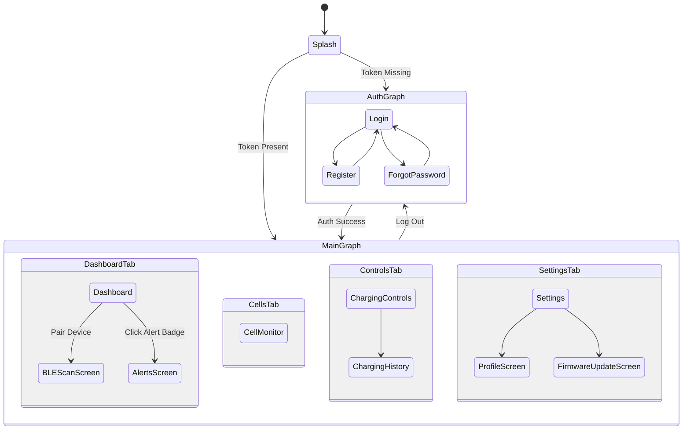

# Android UI Design Specification (Material Design 3 + Jetpack Compose)
## Project: Battery Management System (BMS) Client

---

## 1. Design System & Aesthetics (Material Design 3)

### 1.1 Color Palettes
The application prioritizes a modern, technical, and high-readability design. Colors are dynamically mapped using MD3 color roles.

#### Dark Theme (Primary Mode)
*   **Background**: Deep Charcoal (`#0B0E14`)
*   **Surface / Card Background**: Slate Gray (`#161B22`)
*   **Primary (Energy / Normal State)**: Electric Cyan / Bright Green (`#00E676` or `#00E5FF`)
*   **Secondary (Active balancing / Info)**: Cobalt Blue (`#2979FF`)
*   **Tertiary (Warning / Temperature Alert)**: Amber Gold (`#FFD600`)
*   **Error (Critical Fault / Off State)**: Neon Coral (`#FF1744`)
*   **On Background / On Surface**: Off-white (`#E3E6EB`)
*   **Outline / Border**: Medium Gray (`#30363D`)

#### Light Theme
*   **Background**: Soft Off-White (`#F4F6F9`)
*   **Surface / Card Background**: White (`#FFFFFF`)
*   **Primary (Energy / Normal State)**: Forest Teal (`#00897B`)
*   **Secondary (Active balancing / Info)**: Royal Blue (`#1565C0`)
*   **Tertiary (Warning / Alert)**: Dark Amber (`#FF8F00`)
*   **Error (Critical Fault)**: Crimson (`#C62828`)
*   **On Background / On Surface**: Deep Navy (`#1A202C`)
*   **Outline / Border**: Light Gray (`#E2E8F0`)

### 1.2 Typography & Elements
*   **Font Family**: *Inter* or *Outfit* (clean, geometric sans-serif).
*   **Visual Highlights**: Subtle glassmorphism overlays on telemetry cards, smooth progress animations, micro-indicator animations for cell balancing, and clear color-coded states matching battery health.

---

## 2. Navigation Flow & Graph Hierarchy

The app uses **Jetpack Compose Navigation** with Type-Safe Routing (Kotlin DSL) to divide destinations into logical sub-graphs.



### 2.1 Navigation Routes
```kotlin
// Conceptual navigation structure (Route definitions)
sealed interface Screen {
    object Splash : Screen
    
    sealed interface Auth : Screen {
        object Login : Auth
        object Register : Auth
        object ForgotPassword : Auth
    }
    
    sealed interface Main : Screen {
        object Dashboard : Main
        object CellMonitor : Main
        object ChargingControls : Main
        object Alerts : Main
        object Settings : Main
        
        // Nested sub-destinations
        data class History(val deviceId: String) : Main
        data class BleScan(val initiatingScan: Boolean) : Main
        data class FirmwareUpdate(val deviceId: String) : Main
        object Profile : Main
    }
}
```

---

## 3. Screen Hierarchy & Key Composables

### 3.1 Authentication Graph

#### 3.1.1 Login / Signup / Forgot Password Screens
A unified, responsive UI using an animated slide transition between states.
*   **Layout Structure**:
    *   `Scaffold` with system status bars colored dynamically.
    *   `Box` with a subtle radial gradient background.
    *   `Column` (scrollable via `verticalScroll` to prevent keyboard overlap) containing logo, form fields, and actions.
*   **Key Composables**:
    *   `BmsLogoHeader`: Rendered using custom vectors, presenting a battery animation with charging indicators.
    *   `OutlinedTextField` (MD3): Styled with floating labels, custom icons, trailing visibility toggles for passwords, and explicit error message mappings.
    *   `Button` & `TextButton` (MD3): Elevated primary action buttons and flat buttons for screen swapping.
    *   `LoadingOverlay`: Full-screen transparent container displaying a `CircularProgressIndicator` when auth tasks execute.

---

### 3.2 Main App Graph (Bottom Navigation Base)
The core application utilizes an `M3 Scaffold` enclosing a `NavigationBar` mapped to the 5 primary tabs: Dashboard, Cell Monitor, Controls, Alerts, and Settings.

#### 3.2.1 Dashboard Screen
Displays high-level operational telemetry of the active battery pack.
*   **Layout Structure**:
    *   `LazyColumn` utilizing content padding to enable smooth scroll over bottom nav.
    *   Flexible top app bar indicating connection state (BLE Green, MQTT Blue, Offline Red/Amber).
*   **Key Composables**:
    *   `BatteryPercentageArc`: A custom Canvas-drawn circular radial dial. Displays SoC percentage inside, paired with dynamic color mapping (Red for <15%, Amber for 15-30%, Green for >30%).
    *   `ConnectionStatusBar`: A horizontal pill-shaped status indicator displaying the active communication protocol, MAC address/IP, and signal strength (RSSI).
    *   `TelemetryGrid`: A two-column grid hosting instances of `TelemetryCard`:
        *   *Voltage Card*: Pack voltage and delta-voltage metrics.
        *   *Current Card*: Charging/Discharging current in Amperes, featuring directional arrows (Up/Green for charging, Down/Red for discharging).
        *   *Temperature Card*: Average temperature with hot-spot indicators.
        *   *State of Health (SoH)*: Shows capacity degradation estimates.

#### 3.2.2 Cell Voltage Monitor Screen
Provides high-granularity views of individual cell groups (e.g., 16 cells in series).
*   **Layout Structure**:
    *   Header displaying current cell variance (Max Cell Voltage - Min Cell Voltage).
    *   `LazyVerticalGrid` (Adaptive cell counts based on orientation: 2 columns in portrait, 4 in landscape).
*   **Key Composables**:
    *   `CellVoltageCard`: Displays individual cell indices (e.g., "Cell 05"), actual voltage (e.g., "3.284V"), and a horizontal battery fill-bar. The fill-bar changes colors based on deviation from the pack average.
    *   `BalancingIndicator`: A micro-animation overlay (small flashing lightning bolt or heat icon) rendered on top of cells that are actively discharging energy through passive bypass resistors.
    *   `VoltageDeltaSummary`: A consolidated statistics card mapping the highest cell, lowest cell, and standard deviation.

#### 3.2.3 Charging & Control Screen
Provides configuration settings and remote commands to toggle BMS states.
*   **Layout Structure**:
    *   Header highlighting charging status (Charging, Discharging, Standby, Alert).
    *   Scrollable settings groups categorized using card containers.
*   **Key Composables**:
    *   `ControlSwitchRow`: A custom row containing a text label, description, and an MD3 `Switch` to toggle:
        *   *Charge MOSFET Status* (ON/OFF)
        *   *Discharge MOSFET Status* (ON/OFF)
    *   `ThresholdSliderCard`: Configurable sliders containing input validation hooks. Used by technicians to adjust current limits and voltage limits:
        *   *Slider component* mapped with double indicators (safety threshold vs warning threshold).
    *   `HistoryShortcutCard`: A summary card displaying the last charge session details (capacity added, duration) with a clickable link navigating to the Charging History list.

#### 3.2.4 Battery Health Screen (Diagnostic View)
Tracks capacity loss, internal resistances, and structural health indices of the pack.
*   **Layout Structure**:
    *   Dual-section view: Top card displays overall health status; bottom card lists internal metrics.
*   **Key Composables**:
    *   `SoHIndicatorCard`: Displays estimated residual battery capacity (Ah) vs original nominal capacity, mapping the health grade (e.g., "Excellent", "Degraded").
    *   `ResistanceChart`: A stylized horizontal list depicting the internal resistance of each cell in milliohms ($m\Omega$). Useful for identifying failing cells.
    *   `CycleCounterCard`: Displays complete charge-discharge cycles alongside calendar age.

#### 3.2.5 Charging History Screen
A historical ledger of charge events, helpful for tracking degradation trends.
*   **Layout Structure**:
    *   Filter bar at the top (date ranges, duration, minimum charge added).
    *   `LazyColumn` of historical items.
*   **Key Composables**:
    *   `HistoryListItem`: An MD3 `ElevatedCard` depicting:
        *   Date and starting/ending time.
        *   Starting/ending SoC percentage (e.g., "12% -> 98%").
        *   Energy throughput in Watt-hours ($Wh$) or Amp-hours ($Ah$).
        *   Average charging temperature.
    *   `EmptyHistoryView`: Rendered when search criteria return no results.

#### 3.2.6 Alerts & Notifications Screen
Lists active faults, critical alerts, and historical system notifications.
*   **Layout Structure**:
    *   Filter tabs: All, Active Faults, Alerts, Info logs.
    *   `LazyColumn` with swipe-to-dismiss capabilities.
*   **Key Composables**:
    *   `ActiveFaultBanner`: A persistent flashing warning card rendered at the top of the UI when safety parameters are violated. Displays a large warning icon and a "Mute Alert" toggle.
    *   `AlertMessageRow`: Displays dynamic icons (Red shields for critical faults, Amber triangles for warnings, Blue bells for info notifications), event description, timestamp, and a status checkmark.
    *   `FaultMitigationHelper`: An expandable dropdown helper showing step-by-step guidance to resolve the specific active alert (e.g., "Disconnect charger, allow pack to cool down").

#### 3.2.7 Device Management (BLE Scan / Pairing)
Initiates proximity search for local battery packs.
*   **Layout Structure**:
    *   Dynamic scanning layout featuring permission requests and status notifications.
*   **Key Composables**:
    *   `BleRadarAnimation`: A custom-drawn circular pulse animation visualizing active radio scans.
    *   `ScannedDeviceItem`: A list item showing the Bluetooth local name, signal strength index (RSSI indicator), MAC address, and a "Pair / Connect" button.
    *   `DeviceFilterToggle`: Segmented buttons filtering scanned devices by signal strength or custom naming rules.

#### 3.2.8 Firmware Update Screen (OTA)
Allows technicians to audit and execute firmware installations.
*   **Layout Structure**:
    *   Split display showing current installed software version vs available cloud updates.
*   **Key Composables**:
    *   `VersionComparisonCard`: Displays current firmware version, date of installation, target firmware version, and release size.
    *   `OtaProgressBar`: Shows download state (Downloading binary, verifying signature, flashing blocks, rebooting) combined with a detailed text description.
    *   `ReleaseNotesCard`: A scrollable markdown container showing changelogs, bug fixes, and safety improvements.

#### 3.2.9 Settings & Profile Screen
Configuration panel for account preferences, notifications, and telemetry rates.
*   **Layout Structure**:
    *   Grouped list using Material Design 3 divider lines.
*   **Key Composables**:
    *   `ProfileHeader`: Displays active user email, profile icon, and dynamic user role badge ("Technician" or "Owner").
    *   `SettingsToggleRow`: Standardized rows featuring switches for Dark Mode toggle, units preference (°C vs °F), and background tracking intervals.
    *   `TelemetryIntervalSelector`: A dropdown selector configuring telemetry stream frequency (e.g., "1s", "5s", "30s").
    *   `LogOutButton`: Outlined button with safety warning confirmation modal.

---

## 4. UI State & State Hoisting Patterns

To ensure clean updates and separation of concerns, screens adhere to unidirectional data flow (UDF) utilizing Kotlin state flows.

```
                  ┌──────────────────────┐
                  │      ViewModel       │
                  └──────────┬───────────┘
                             │ UIState Flow
                             ▼
                  ┌──────────────────────┐
                  │   Parent Composable  │
                  └──────────┬───────────┘
                             │ state properties
                             ▼
                  ┌──────────────────────┐
                  │    UI Composables    │
                  └──────────────────────┘
```

### 4.1 Telemetry UI State Representation
```kotlin
// Represents states observed by the Dashboard & Cell Monitor views
sealed interface TelemetryUiState {
    object Loading : TelemetryUiState
    
    data class Connected(
        val deviceName: String,
        val connectionType: ConnectionType, // BLE or MQTT
        val rssi: Int,
        val soc: Int,
        val voltage: Float,
        val current: Float,
        val temperatures: List<Float>,
        val cellVoltages: List<Float>,
        val activeBalancingCells: List<Int>,
        val activeFaults: List<String>
    ) : TelemetryUiState
    
    data class Disconnected(
        val lastSeen: Long,
        val reason: String
    ) : TelemetryUiState
    
    data class Error(val message: String) : TelemetryUiState
}
```
*   **State Hoisting**: Leaf composables (like `TelemetryCard` and `CellVoltageCard`) do not reference `ViewModels`. They receive states as primitive parameters/data models and emit events via lambda callbacks (e.g., `onCommandClick: (String) -> Unit`).
